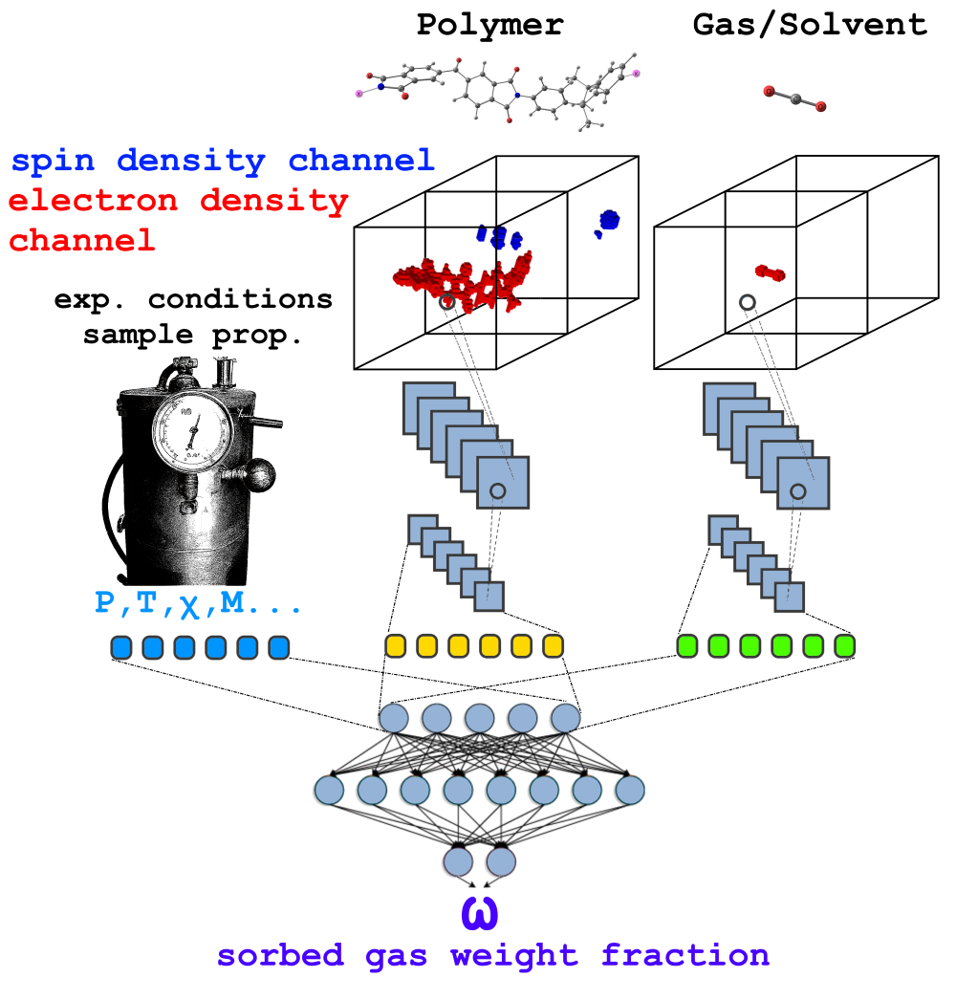
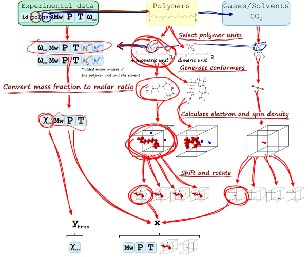

# RhNet: prediction of gas in polymer solubility based on electron density distribution
 
This repository contains a script to train and evaluate a convolutional neural
network (CNN) to predict a gas/solvent weight fraction in a (possibly swollen) 
polymer using a pre-calculated distribution of the electron density.


*(image created using DALL·E 2)*

**_!!! Please, note that inference and preparation of data for inference are 
not yet implemented, but will be available soon !!!_** 

## Contents
 
- [Overview](#overview)
- [Reference](#reference)
- [Quick Start Guide](#quick-start-guide)
   * [Requirements](#requirements)
   * [Setup](#setup)
   * [Run](#run)
- [Advanced](#advanced)
   * [Repo structure](#repo-structure)
   * [Parameters](#parameters)
   * [Command-line options](#command-line-options)
- [Dataset structure](#dataset-structure)
   * [Dataset overview](#dataset-overview)
   * [Training example assembly](#training-example-assembly)
   * [Dataset for inference](#dataset-for-inference)
   * [Dataset for training](#dataset-for-training)
- [Electron density generation](#electron-density-generation)
     * [qcdata_gen overview](#qcdata_gen-overview)
     * [qcdata_gen requirements](#qcdata_gen-requirements)
     * [qcdata_gen setup](#qcdata_gen-setup)
     * [qcdata_gen run for inference data](#qcdata_gen-run-for-inference-data)
     * [qcdata_gen run for training data](#qcdata_gen-run-for-training-data)
- [TODO](#todo)
- [Notes](#notes)
     * [Excluded data sources](#excluded-data-sources)
     * [Other notes](#other-notes)

## Overview



 
The RhNet model is a convolutional neural network aimed to predict the pressure 
and temperature dependent gas/solvent weight fraction in a (swollen) polymer. 
Prediction is based on 3D images of electron density distributions in a solvent
molecule and in a polymer monomer/oligomer. Basically it combines two key 
ideas:
- to use a CNN to process electron density distribution and generate 
features to be fed to a dense network (see for example 
[Prediction of Energetic Material Properties from Electronic Structure Using 
3D Convolutional Neural Networks](https://dx.doi.org/10.1021/acs.jcim.0c00259)) 
- to concatenate arrays of a polymer and a solvent features and an array of 
experimental conditions and feed them to a dense network (see for example 
[Machine Learning for Polymer Swelling in Liquids](https://dx.doi.org/10.1021/acsapm.0c00586))

Generally, the resulting architecture resembles some face recognition and face
verification models (see for example 
[this lecture by Andrew Ng](https://www.coursera.org/lecture/convolutional-neural-networks/face-verification-and-binary-classification-xTihv))


## Reference

The research paper with detailed description of the project is available 
on-line at [ChemRxiv](https://doi.org/10.26434/chemrxiv-2023-tqv4p). In case 
you find the model or the dataset useful please cite:

Gromov, O.I. Predicting the Solubility of Gases, Vapors, and Supercritical 
Fluids in Amorphous Polymers from Electron Density using Convolutional Neural
Networks, ChemRxiv, 2023, 10.26434/chemrxiv-2023-tqv4p


## Quick Start (with NVIDIA Docker)

### Requirements
 
The repository contains a Dockerfile which adds RhNet dependencies over
a TensorFlow NGC container. To run an NGC container one will need:
- [NVIDIA Docker](https://github.com/NVIDIA/nvidia-docker)
- Volta/Turing/Ampere and higher-based GPU
 
For more information on NGC containers and their compatibility refer 
to [NVIDIA Container Support Matrix](https://docs.nvidia.com/deeplearning/frameworks/support-matrix/index.html).
 
### Setup
 
1. Clone the repository

   ```bash
   git clone https://github.com/Shorku/rhnet
   cd rhnet
   ```
 
2. Build the NGC container with additional layers
     
   ```
   docker build -t rhnet .
   ```
  
   The NGC container encapsulates Python, TensorFlow and other necessary 
   components optimized for usage on NVIDIA hardware. `docker build` will
   automatically download specified in `Dockerfile` image of an NGC container,
   install some additional python modules and copy the whole current directory
   with the rhnet script.

   **Note**, *the quantum-chemical data may be really huge. Make sure there is 
   no  quantum-chemical data within the current folder while building rhnet 
   image, otherwise it will be also copied.*
   
   
3. Start the NGC container in the interactive mode
  
   ```bash
   mkdir data
   mkdir results
   docker run --runtime=nvidia -it --shm-size=<available_RAM>g --ulimit memlock=-1 --gpus all --rm --ipc=host -v ${PWD}/data:/data -v ${PWD}/results:/results rhnet /bin/bash
   ```
  
   This command will launch the container and mount the `./data` directory as a
   volume to the `/data` directory inside the container, and `./results` 
   directory to the `/results` directory in the container. Any results (logs, 
   checkpoints, etc.) will be saved to `/results` and will be accessible
   in the `./results` directory on the host.

   **Note**, *`--shm-size=100g` for example will share 100 GiB between the host
   and your docker container: pnet preloads the quantum chemical data to the 
   RAM and in the case of huge datasets will need more RAM, than the default 
   amount. Make sure to adjust this parameter.*

     
4. Download or generate the data
   
   `rhnet/data` folder contains experimental data and other necessary
   tables for the RhNet to perform training and inference. The only exception
   are the electron densities, which can be downloaded elsewhere.

   To perform **both training and inference** the script expects the dataset
   folder to contain the following files:

   `polymer_mass.csv` (suitable for training and prediction)

   `solvent_mass.csv` (suitable for training and prediction)

   and `cubes` folder with the electron density images

   optionally if the model is intended to use solvent macroparameters:

   `solvent_macro_features.csv` (suitable for training and prediction)

   To perform **inference** the script also expects the dataset folder 
   to contain the following file:

   `to_predict_ranges.csv` (example suitable for inference)

   To perform **training** the script also expects the dataset folder 
   to contain the following files:

   `experimental_dataset.csv` (suitable for training)

   `polymers.txt` (suitable for training)

   `solvents.txt` (suitable for training)

   For an in-depth description of the dataset structure refer to 
   [Dataset structure](#dataset-structure) section.

   For a custom dataset generation procedure refer to 
   [Electron density generation](#electron-density-generation) section.

   
### Run

1. Inference

   **Coming soon**
 
2. Training
   
   **Actual model**
   ```bash
   python3 main.py --data_dir /data --model_dir /results --batch_size 8 --epochs 100 --exec_mode train --log_name multikernel --augment 25 --model multikernel --api builtin --use_only_mw --use_only_amorph --store_density cache --xla --amp --activation elu --learning_rate 0.000005 --save_model --log_dir tb_logs/fit --make_even --eval_define val_pairs.csv --checkpoint_every 20 --dnn_l2 0.00001 --cnn_l2 0.00001
   ```
   **Basic:**
   
   ```bash
   python3 main.py --exec_mode train --data_dir /data --model_dir /results --batch_size 24 --epochs 20 --log_dir /logs --log_name mylog --augment 25
   ```
   `--batch_size` tells the script the size of mini batch

   `--epochs` tells the script the number of epochs (how many times the whole 
   set will be consumed)*

   `--augment` tells the script how many shifted/rotated electron density 
   3D images are available.**

   **Mixed precision:**

   (lower memory consumption, faster evaluation)
   ```bash
   python3 main.py --exec_mode train --xla --amp  --data_dir /data --model_dir /results --batch_size 24 --epochs 20 --log_dir /logs --log_name mylog --augment 25
   ```
   `--xla` tells the script to enable accelerated linear algebra optimization

   `--amp` tells the script to enable automatic mixed precision

   **With L2 regularization:**
   
   ```bash
   python3 main.py --dnn_l2 0.005 --cnn_l2 0.005 --exec_mode train --data_dir /data --model_dir /results --batch_size 24 --epochs 20 --log_dir /logs --log_name mylog --augment 25
   ```
   `--dnn_l2` tells the script to include regularizing term calculated using 
              the weights of the dense part of the net in loss function

   `--cnn_l2` tells the script to include regularizing term calculated using 
              the weights of the convolutional part of the net in loss function
  
   The result will be stored in a checkpoint file in `./results` folder, if 
   `--save_model` of `--checkpoint_every` options are invoked.

   **Notes:**

   * By default, the script will try to balance the set. First it will generate 
   a lookup table, which for every experimental point will contain all possible 
   combinations of conformations and augmentations of the corresponding polymer
   and solvent. Then every epoch it will sample a random subset so that all 
   polymer-solvent pairs will have equal shares within the sampled set, while 
   all experimental points will also have equal shares within their 
   polymer-solvent pairs share. 
   * Augmentation is computationally heavy and is done by a separate script 
   outside the training procedure. On-the-fly augmentation is to be implemented
   later. 

 
3. Training with validation.
  
   The model can be evaluated while training by passing the `--eval_split` 
   flag:
     
   ```bash
   python3 main.py --exec_mode train --eval_split <natural number> --evaluate_every 1 --data_dir /data --model_dir /results --batch_size 24 --epochs 20 --log_dir /logs --log_name mylog --augment 25
   ```
  
   `--eval_split n` will tell the script to split the set into training and 
   validation subsets. `1/n` fraction of the total set will be assigned to the 
   validation set, while the rest will be used for training.

   `--evaluate_every n` will tell the script to evaluate the models performance 
   every `n` epochs.

   **Notes:**

   * validation set can also be defined using `--eval_define my_val_pairs.csv` 
   option, see [General parameters](#general-parameters) section for details.
   
 
4. Training with cross-validation.
  
   To perform n-fold cross-validation a `--fold` flag should be passed:
     
   ```bash
   python3 main.py --exec_mode train --fold <natural/number> --evaluate_every 1 --data_dir /data --model_dir /results --batch_size 24 --epochs 20 --log_dir /logs --log_name mylog --augment 25
   ```
  
   `--fold n` will tell the script to randomly split the set into `n` subsets. 
   Next the script will `n` times train the model from scratch using each 
   subset as a validation set.
   
   **Notes:**

   * cross-validation feature wasn't tested for a long time, sorry


## Advanced
 
The following sections provide details of the script structure and available 
options.
 
### Repo structure
 
The root directory contains:
* `main.py`: The entry point of the application.
* `Dockerfile`: Specifies the container with the basic set of dependencies to 
run RhNet.
* `requirements.txt`: Extra requirements for RhNet.

The `runtime/` folder encapsulates the runtime logic:
* `run.py`: Implements the logic for training, evaluation, testing and 
prediction.
* `setup.py`: Implements the functions to set up environment, create necessary
directories, and initiate logging.
* `arguments.py`: Command-line arguments parsing.

The `data_loading/` folder encapsulates the dataset loading and construction 
logic:
* `data_loader.py`: Implements loading of the necessary tables, construction
and splitting of the dataset into train and evaluation subsets, and provides a 
generator to prepare examples for training and evaluation.

The `model/` folder contains RhNet and its building blocks:
* `blocks.py`: Implements different blocks that are used to assemble RhNet.
* `rhnet.py`: Defines the model architecture.
 
The `utils/` folder encapsulates some minor utility functions in `utils.py`

The `data/` folder contains the dataset (except for the calculated electron 
densities), for details refer to the [Dataset structure](#dataset-structure) 
section.

The `qcdata_gen/` folder contains a script, which automates the quantum 
chemical data (electron and spin densities) generation, for details refer to 
the [Electron density generation](#electron-density-generation) section.
 
The `images/` folder contains README figures.
 
### Parameters
 
Following is a list of the available parameters for the `main.py` script:


#### General parameters

* `--exec_mode`: The execution mode of the script:
  * `train`: (DEFAULT) trains model.
  * `evaluate`: performs evaluation on the validation subset.
  * `predict`: loads checkpoint and runs inference (***is not implemented***).
    Predictions will be saved to {--log_dir}/prediction_{--log_name}.csv.
  * `error_analysis`: performs evaluation on the whole dataset and save the 
    whole augmented dataset (without images but their indexes) to 
    full_table_{--log_name}.csv and predicted values to 
    detailed_pred_{--log_name}.csv for subsequent analysis
* `--model_dir`: The directory to save checkpoints and the trained model. 
DEFAULT: `./results`. 
* `--data_dir`: The directory containing the dataset. Required parameter.
* `--data_csv`: The .csv file containing experimental sorption data. The `.csv` file should look like
    (DEFAULT: `experimental_dataset.csv`):
```bash
expno,polymer,solvent,mn,mw,cryst,tg,dens,pressure,temperature,wa,doi,notes
1,1,11,18000,80000,0,593,1.2,0.002,283.5,0.08,"10.1021/ie3027873","Huntsman Advanced Materials"
2,1,11,18000,80000,0,593,1.2,0.004,283.5,0.10,"10.1021/ie3027873","Huntsman Advanced Materials"
...
```
* `--to_pred_csv`: The .csv file containing intended for prediction parameters
    ranges. The `.csv` file should look like (DEFAULT: `to_predict_ranges.csv`):
```bash
polymer,solvent,mn,mw,cryst,tg,dens,pmin,pmax,npstep,tmin,tmax,ntstep
1,1,18000,80000,0,593,1.2,0.1,1.0,10,298.15,308.15,3
1,10,18000,80000,0,593,1.2,0.1,1.0,10,298.15,308.15,3
...
```
* `--api`: Whether to use Keras builtin or custom training/evaluating loop:
   * `builtin`: (DEFAULT) use builtin Keras loops
   * `custom`: use custom loops
* `--store_density`: Where to store electron density images:
   * `ram`: preloads images to RAM before training/evaluation. Will save some 
    time on I/O but can consume much memory
   * `file`: loads images during training/evaluation from disk every time. 
    Reduces RAM demands but creates I/O bottleneck
   * `cache`: loads images during training/evaluation from disk, but store 
    already loaded images in RAM for all subsequent usages 
* `--log_dir`: The directory to store logs. DEFAULT: `.`.
* `--log_name`: Suffix for different log files. DEFAULT: `None`.
* `--log_every`: Log performance every ... steps (for dllogger and custom 
    training loop)
* `--xla`: Enable accelerated linear algebra optimization. DEFAULT: `False`.
* `--amp`: Enable automatic mixed precision. DEFAULT: `False`.


#### Model definition parameters

* `--model`: index of the RhNet model to be used. Different models are defined
    in `rhnet.py`. DEFAULT: `linear`.
* `--activation`: activation function:
   * `relu`: use ReLU (rectified linear unit) activation
   * `sigmoid`: use Sigmoid activation
   * `tanh`: use Tanh (hyperbolic tangent) activation
   * `leaky_relu`: use Leaky ReLU (leaky rectified linear unit) activation
   * `elu`: use ELU (exponential linear unit) activation
* `--pooling`: choose pooling function for convolutional part of the network:
   * `av`: downsize images with averaging
   * `max`: conventional maxpooling
* `--save_model`: Save the model after the training run. DEFAULT: `False`.
* `--resume_training`: Load the model from the checkpoint in the `model_dir`. 
    If not enabled, the `model_dir` will be rewritten. DEFAULT: `False`.
* `--load_model`: Load the saved model. DEFAULT: `False`.
* `--mw`: Use only Mw (weight average molecular weight) and drop Mn (number 
average molecular weight) features. If not enabled, both Mw and Mn features 
are used. DEFAULT: `False`.
* `--amorph`: Use only amorphous/melted polymers from the dataset and drop the
`cryst` feature. DEFAULT: `False`.
* `--tg`: Use polymer glass transition temperature as a feature. 
DEFAULT: `False`.
* `--dens`: Use polymer density at normal conditions as a feature. DEFAULT: 
`False`.
* `--bt`: Use solvents boiling temperature at normal pressure as a feature. 
DEFAULT: `False`.
* `--ctp`: Use solvents critical temperature and pressure as features. 
DEFAULT: `False`.


#### Data related parameters

* `--augment`: Tells the script, how many augmented (shifted and rotated) 
    electron densities images are available for each molecular geometry. 
    Augmentation itself is done elswhere. DEFAULT: `25`.
* `--make_even`: Try to tune sampling weights to equalize impacts of the 
    examples with medium and high solvent content assuming normal distribution
* `--analysis_n`: Loop only through the first `n` examples of the dataset 
in error analysis mode


#### Evaluation/holdout split parameters

* `--eval_split`: Turns on evaluation during model training. If 
    ***--eval_split n*** is specified, the script will randomly sample 
    1/***n*** of the polymer-solvent pairs into the validation set. 
    DEFAULT: `None`.
* `--eval_define`: Path to the `.csv` file which defines the polymer-solvent 
    pairs to be excluded from the training set and to be included in the 
    validation set for the training-time evaluation. The `.csv` file should 
    look like (DEFAULT: `None`):
```bash
polymer,solvent
25,10
25,37
16,2
19,45
...
```
* `--fold`: Turns on ***n***-fold cross-validation. Randomly splits the dataset
    into ***n*** parts and performs ***n*** training runs using each part as a
    validation subset. Overrides `--eval_split`. DEFAULT: `None`.
* `--holdout_define`: Path to the `.csv` file which defines the polymer-solvent
    pairs to be excluded from the dataset during the current run. The `.csv` 
    file has the same structure as described for `--eval_define`. (DEFAULT:
    `None`)
* `--restrict_to_define`: Path to the `.csv` file which defines the 
    polymer-solvent pairs to be used during the current run (everything else
    will be excluded). The `.csv` file has the same structure as described for
    `--eval_define`. (DEFAULT: `None`)


#### Training/evaluation parameters

* `--batch_size`: Size of the minibatch. DEFAULT: `1`.
* `--learning_rate`: Adam’s learning rate. DEFAULT: `0.0001`.
* `--learning_rate_decay`: Learning rate exponential decay coefficient. 
   DEFAULT: `0.0001`.
* `--learning_rate_decay_steps`: Learning rate exponential decay rate. 
   DEFAULT: `600000`.
* `--max_steps`: Maximum number of steps (batches) for each epoch during a 
    training run. If set to `0` will consume the whole dataset. DEFAULT: `0`.
* `--epochs`: Sets the number of epochs for the training run. DEFAULT: `1`.
* `--evaluate_every`: Perform evaluation during model training every ***n*** 
    epochs. DEFAULT: `1`.
* `--checkpoint_every`: Save a model checkpoint every n epochs. Will not save
    checkpoints if set to `0`. DEFAULT: `0`.


#### Regularization parameters

* `--dnn_dropout`: Use dropout regularization for dense part. DEFAULT: `None`.
* `--cnn_dropout`: Use dropout regularization for convolutional part. 
    DEFAULT: `None`.
* `--dnn_l2`: Use l2 regularization for dense part. DEFAULT: `0`.
* `--cnn_l2`: Use l2 regularization for convolutional part. DEFAULT: `0`.


#### Miscellaneous

* `--zdt`: Perform a second run of error analysis using zero densities


### Command-line options 

To see the full list of available options and their descriptions, use the `-h` or `--help` command-line option, for example:
```bash
python main.py --help
```
 
The following example output is printed when running the model:
```python main.py --help
usage: main.py [-h] [--exec_mode {train,evaluate,predict,error_analysis,train_and_error_analysis}] 
               [--model_dir MODEL_DIR] [--data_dir DATA_DIR] [--data_csv DATA_CSV]
               [--to_pred_csv TO_PRED_CSV] [--api {builtin,custom}] 
               [--store_density {ram,file,cache}] [--log_dir LOG_DIR] [--log_name LOG_NAME]
               [--log_every LOG_EVERY] [--use_amp] [--use_xla] [--model MODEL] 
               [--activation {relu,sigmoid,tanh,leaky_relu,elu}] 
               [--pooling {av,max}] [--save_model] [--resume_training] 
               [--load_model] [--use_only_mw] [--use_only_amorph] [--use_tg]
               [--use_dens] [--use_solvent_boil_temp] [--use_solvent_cryt_point] 
               [--augment AUGMENT] [--even_ratios_distrib] [--analysis_n ANALYSIS_N] 
               [--eval_split EVAL_SPLIT] [--eval_define EVAL_DEFINE] [--fold FOLD]
               [--holdout_define HOLDOUT_DEFINE] [--restrict_to_define RESTRICT_TO_DEFINE]
               [--batch_size BATCH_SIZE] [--learning_rate LEARNING_RATE] 
               [--learning_rate_decay LEARNING_RATE_DECAY]
               [--learning_rate_decay_steps LEARNING_RATE_DECAY_STEPS] 
               [--max_steps MAX_STEPS] [--epochs EPOCHS] [--evaluate_every EVALUATE_EVERY] 
               [--checkpoint_every CHECKPOINT_EVERY]
               [--dnn_dropout DNN_DROPOUT] [--cnn_dropout CNN_DROPOUT] 
               [--dnn_l2 DNN_L2] [--cnn_l2 CNN_L2] [--zero_density_test]

RhNet

optional arguments:
  -h, --help            show this help message and exit
  --exec_mode {train,evaluate,predict,error_analysis,train_and_error_analysis}
                        Execution mode of running the model
  --model_dir MODEL_DIR
                        Output directory for saved model and checkpoints
  --data_dir DATA_DIR   Directory with the dataset
  --data_csv DATA_CSV   CSV file with experimental part of the dataset relative 
                        to data_dir
  --to_pred_csv TO_PRED_CSV   
                        CSV file with intended for prediction parameters
                        ranges
  --api {builtin,custom}
                        Whether to use Keras builtin or custom training loop
  --store_density {ram,file,cache}
                        Where to store density images
  --log_dir LOG_DIR     Output directory for training logs
  --log_name LOG_NAME   Suffix for different log files
  --log_every LOG_EVERY
                        Log performance every n steps
  --use_amp, --amp      Train using TF-AMP
  --use_xla, --xla      Train using XLA
  --model MODEL         Model index
  --activation {relu,sigmoid,tanh,leaky_relu,elu}
                        Activation function
  --pooling {av,max}    Pooling function
  --save_model          Save model after training
  --resume_training     Resume training from a checkpoint
  --load_model          Resume training from a saved_model
  --use_only_mw, --mw   Use only Mw and drop Mn
  --use_only_amorph, --amorph
                        Drop semi-crystalline poly
  --use_tg, --tg        Use polymer Tg feature
  --use_dens, --dens    Use polymer density feature
  --use_solvent_boil_temp, --bt
                        Use solvent Tb feature
  --use_solvent_cryt_point, --ctp
                        Use solvent critical point feature
  --augment AUGMENT     Number of shifted and rotated densities per geometry. 
                        Note: the option affects only indexing, augmentation 
                        itself is done elsewhere
  --even_ratios_distrib, --make_even
                        Tune sampling weights to equalize impacts of the 
                        examples with medium and high solvent content
  --analysis_n ANALYSIS_N
                        Number of samples to be used in error analysis. Use 
                        full table if not specified
  --eval_split EVAL_SPLIT
                        Turn on validation during training. Randomly sample 
                        1/val_split examples into validation set
  --eval_define EVAL_DEFINE
                        Turn on validation during training. Filepath to a .csv 
                        file defining polymer-solvent pairs to be used in 
                        evaluation (validation). Will override --eval_split 
                        option.
  --fold FOLD           Turn on cross-validation during training. Randomly 
                        split the dataset into a defined number of parts for 
                        cross-validation. None - no cross-val. Will override
                        --eval_split and --eval_define
  --holdout_define HOLDOUT_DEFINE
                        Exclude the data associated with the defined
                        polymer-solvent pairs from the currently used dataset.
                        Filepath to a .csv file defining polymer-solvent pairs
                        to be excluded.
  --restrict_to_define RESTRICT_TO_DEFINE
                        Include in the currently used dataset only the data
                        associated with the defined polymer-solvent pairs. 
                        Filepath to a .csv file defining polymer-solvent pairs
                        to be included.
  --batch_size BATCH_SIZE
                        Size of each minibatch per GPU
  --learning_rate LEARNING_RATE
                        Learning rate coefficient for AdamOptimizer
  --learning_rate_decay LEARNING_RATE_DECAY
                        Learning rate exponential decay coefficient
  --learning_rate_decay_steps LEARNING_RATE_DECAY_STEPS
                        Learning rate exponential decay rate
  --max_steps MAX_STEPS
                        Maximum number of steps (batches) in training 
                        If --max_steps 0 consume the whole set
  --epochs EPOCHS       Number of epochs used in training
  --evaluate_every EVALUATE_EVERY
                        Evaluate performance (validate) every n epochs
  --checkpoint_every CHECKPOINT_EVERY
                        Save checkpoint every ... epochs
  --dnn_dropout DNN_DROPOUT
                        Use dropout regularization for dense part
  --cnn_dropout CNN_DROPOUT
                        Use dropout regularization for conv part
  --dnn_l2 DNN_L2       Use l2 regularization for dense part
  --cnn_l2 CNN_L2       Use l2 regularization for conv part
  --zero_density_test, --zdt
                        Perform a second run of error analysis using zero 
                        densities
```

## Dataset structure

### Dataset overview
The `data/` folder contains the current version of the dataset. It includes
following files:


`data/experimental_dataset.csv`


`data/list_of_polymers.csv` matches the names of polymers and their ID numbers
in the dataset


`data/list_of_solvents.csv` matches the names of solvents and their ID numbers
in the dataset


`data/geometries.tar.xz` archive provides **geometries of solvents and 
polymers'** repeating units (in `XYZ` format) which were used to calculate 
electron densities. Filenames in the archive use the following convention:
* Filenames contain four indexes separated by `_`
* The first index is a letter: either `p`(olymer) or `s`(olvent)
* Second index is an ID number of polymer specified in 
`data/list_of_polymers.csv` or solvent specified in `data/list_of_solvents.csv`
* Third index if for the choice of a particular repeating unit of a polymer
and is always 1 for solvents.
* Fourth index enumerates conformational isomers 

For example `p_3_2_1.xyz` will contain geometry of:
* polymer, as it starts with `p`
* polyethylene (-CH<sub>2</sub>CH<sub>2</sub>-)<sub>n</sub> which is defined by
index `3`
* -CH<sub>2</sub>CH<sub>2</sub>CH<sub>2</sub>CH<sub>2</sub>- repeating unit 
defined by index `2`
* conformational isomer of the 
-CH<sub>2</sub>CH<sub>2</sub>CH<sub>2</sub>CH<sub>2</sub>- repeating unit 
number `1`


`data/smiles.tar.xz` archive contains polymers' repeating units and solvents
in SMILES format. It is provided within the dataset to simplify its use in 
fitting of models with other than electron density molecular representations. 
Dangling bonds in polymers' repeating units are caped with Fr-atoms. Filenames 
in the archive use the following convention:
* Filenames contain two indexes separated by `_`
* The first index is a letter: either `p`(olymer) or `s`(olvent)
* Second index is an ID number of polymer specified in 
`data/list_of_polymers.csv` or solvent specified in `data/list_of_solvents.csv`


`data/polymers.txt`


`data/polymer_mass.csv`


`data/solvent_mass.csv`


`data/solvent_macro_features.csv`


`data/val_pairs.csv`


`data/test_pairs.csv`

### Training example assembly




### Dataset for inference


### Dataset for training


## Electron density generation


Repository contains a script to generate and augment 3D images of electron 
density distribution in a format suitable for the RhNet model.

_Section is under construction_

### qcdata_gen overview

 
The qcdata_gen script is intended to perform two main tasks:

- generate quantum-chemical data for training
- generate quantum-chemical data for inference

The workflows in these cases differ. For a general description of training 
data generation refer to the paper from [Reference](#reference) section 


### qcdata_gen requirements
 
To run the script one will need:
- [ORCA](https://orcaforum.kofo.mpg.de/index.php) - An ab initio, DFT and 
semiempirical SCF-MO package
- [RDKit](https://www.rdkit.org/)* - Open-Source Cheminformatics Software
- [XTB](https://xtb-docs.readthedocs.io/en/latest/contents.html)* - 
Semiempirical Extended Tight-Binding Program Package
- [conformers](http://limor1.nioch.nsc.ru/quant/program/conformers/)* - a 
standalone script for identical structures filtering

   **Notes:**
   * RDKit, XTB, and conformers are only needed for training dataset generation 

 
### qcdata_gen setup

 
   Download and install prerequisites.
     
   ```
   this item is under construction
   ```

### qcdata_gen run for inference data


### qcdata_gen run for training data

The script can consume multiple .mol files from the input directory. 
 
   **Basic:**
   
   ```bash
   python3 main.py --pal <ncores> --mol_dir <input_path> --out_dir <output_path> --conf_path <conf_path>
   ```
   `<ncores>` number of CPU cores to use in geometry optimizations

   `<input_path>` a directory where the script will look for input .mol files 

   `<output_path>` a directory where temporary files and the results will be
stored

   `<conf_path>` a directory where `conformers` script is stored. Can also be
defined in `CONFORMERS` environment variable

   **Other options:**

To see the full list of available options and their descriptions, use the `-h` or `--help` command-line option, for example:
```bash
python main.py --help
```
 
The following example output is printed:
```
usage: main.py [-h] 
               [--mol_dir MOL_DIR] --out_dir OUT_DIR [--pal PAL] 
               [--conf_level {ff,semi,dft,ff_dft}] [--rdkit_thresh RDKIT_THRESH] 
               [--rdkit_nconf RDKIT_NCONF] [--rdkit_thresh_keep RDKIT_THRESH_KEEP] 
               [--orca_thresh_keep ORCA_THRESH_KEEP] [--orca_path ORCA_PATH] 
               [--conf_path CONF_PATH]

confgen

optional arguments:
  -h, --help            show this help message and exit
  --mol_dir MOL_DIR     input .mol structures directory
  --out_dir OUT_DIR     directory with output data
  --pal PAL             number of CPU cores to use in calculations
  --conf_level {ff,semi,dft,ff_dft}
                        highest level of conf geometry optimization, 
                        successively optimize at ff, xtb and dft levels by 
                        default. For example xtb option will do ff and
                        xtb optimizations. ff-dft will omit xtb step.
  --rdkit_thresh RDKIT_THRESH
                        conformers energy difference criteria
  --rdkit_nconf RDKIT_NCONF
                        max number of conformers rdkit will generate
  --rdkit_thresh_keep RDKIT_THRESH_KEEP
                        energy window to keep conformers within, kJ/mol
  --orca_thresh_keep ORCA_THRESH_KEEP
                        energy window to keep conformers within, kJ/mol
  --orca_path ORCA_PATH
                        ORCA location, it can also be taken from env
  --conf_path CONF_PATH
                        CONFORMERS location, it can also be taken from env
```


## TODO
### General
- [ ] complete documentation
### Inference
- [x] inference utility
- [ ] XYZ (geometry) to ready-to-use NPY (image) automation (for inference)
- [ ] prune and upload fitted models
- [ ] utility for nice inference reports (Matplotlib + LaTeX?)
- [ ] option for a lighter (RI-PBE/def2-SVP?) electron density calculation
### Maintenance
- [ ] test automation
- [ ] compactize model definition code
- [ ] refactor stuff triggering SettingWithCopyWarning
### Further development
- [ ] on-the-fly translational and rotational augmentation
- [ ] sparse convolutions
### Misc minor stuff
- [ ] unify feature selection
- [ ] add ORCA docker
- [x] check smiles.tar.xz for non-minimal polymer repeating units
- [x] check smiles.tar.xz for presence of S-O bonds instead of S=O bonds
- [ ] add to qcdata_gen script a check for a single-atom input geometry
- [x] merge solvents 31 and 63 - both are SO2


## Notes

### Excluded data sources

- 10.3390/polym14030596. Reason: Table 2 disagrees with Figure 11.
- 10.1002/pen.760211409. Reason: microsphere samples seem to be too micro =)
- 10.1016/j.supflu.2022.105534. Reason: In section 2.3.1 it is stated, that
the (P and T independent) integral molar absorptivity was used, while in 
section 2.3.2.2 and Figure 5 the (P and T dependent?) intensity based 
extinction coefficient is clearly used. 
- 10.1002/polb.22209. Reason: the measured data deviates from other sources
by up to 100%.
- 10.1080/19443994.2014.981931. Reason: LiCl was not removed from mPBI samples
- 10.1021/ma302155j. Reason: temperature is specified as "room temperature"
- 10.1016/j.supflu.2013.12.021. Reason: PEG melting temperatures are quite 
likely wrongly determined to fall in range 410-440 K, sorption isotherms have
strange discontinuities

### Other notes

- 10.1002/polb.1181. Dual mode sorption parameters are apparently incorrect


