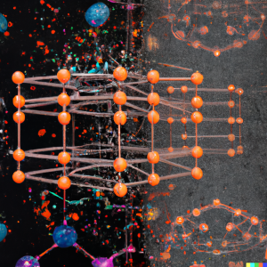

# RhNet: prediction of gas in polymer solubility based on electron density distribution
 
This repository contains a script to train and evaluate a convolutional neural
network (CNN) to predict a gas/solvent weight fraction in a (possibly swollen) 
polymer using a pre-calculated distribution of the electron density.



*(image created using DALL·E 2)*

## Contents
 
- [Overview](#overview)
- [Reference](#reference)
- [Quick Start Guide](#quick-start-guide)
   * [Requirements](#requirements)
   * [Setup](#setup)
   * [Run](#run)
- [Advanced](#advanced)
   * [Repo structure](#repo-structure)
   * [Parameters](#parameters)
   * [Command-line options](#command-line-options)
- [Dataset structure](#dataset-structure)
   * [Dataset overview](#dataset-overview)
   * [Example assembly](#example-assembly)
   * [Dataset for inference](#dataset-for-inference)
   * [Dataset for training](#dataset-for-training)
- [Electron density generation](#electron-density-generation)
     * [qcdata_gen overview](#qcdata_gen-overview)
     * [qcdata_gen requirements](#qcdata_gen-requirements)
     * [qcdata_gen setup](#qcdata_gen-setup)
     * [qcdata_gen run for inference data](#qcdata_gen-run-for-inference-data)
     * [qcdata_gen run for training data](#qcdata_gen-run-for-training-data)
- [TODO](#todo)
- [Notes](#notes)
     * [Excluded data sources](#excluded-data-sources)
     * [Other notes](#other-notes)

## Overview


 
The RhNet model is a convolutional neural network aimed to predict the pressure 
and temperature dependent gas/solvent weight fraction in a (swollen) polymer. 
Prediction is based on 3D images of electron density distributions in a solvent
molecule and in a polymer monomer/oligomer. Basically it combines two key 
ideas:
- to use a CNN to process electron density distribution and generate 
features to be fed to a dense network (see for example 
[Prediction of Energetic Material Properties from Electronic Structure Using 
3D Convolutional Neural Networks](https://dx.doi.org/10.1021/acs.jcim.0c00259)) 
- to concatenate arrays of a polymer and a solvent features and an array of 
experimental conditions and feed them to a dense network (see for example 
[Machine Learning for Polymer Swelling in Liquids](https://dx.doi.org/10.1021/acsapm.0c00586))

Generally, the resulting architecture resembles some face recognition and face
verification models (see for example 
[this lecture by Andrew Ng](https://www.coursera.org/lecture/convolutional-neural-networks/face-verification-and-binary-classification-xTihv))


## Reference

The research paper with detailed description of the project is available 
on-line at [ChemRxiv](https://doi.org/10.26434/chemrxiv-2023-tqv4p-v4). In case 
you find the model or the dataset useful please cite:

Gromov, O.I. Predicting the Solubility of Gases, Vapors, and Supercritical 
Fluids in Amorphous Polymers from Electron Density using Convolutional Neural
Networks, ChemRxiv, 2023, 10.26434/chemrxiv-2023-tqv4p-v4


## Quick Start (with NVIDIA Docker)

### Requirements
 
The repository contains a Dockerfile which adds RhNet dependencies over
a TensorFlow NGC container. To run an NGC container one will need:
- [NVIDIA Docker](https://github.com/NVIDIA/nvidia-docker)
- Volta/Turing/Ampere and higher-based GPU
 
For more information on NGC containers and their compatibility refer 
to [NVIDIA Container Support Matrix](https://docs.nvidia.com/deeplearning/frameworks/support-matrix/index.html).
 
### Setup
 
1. Clone the repository

   ```bash
   git clone https://github.com/Shorku/rhnet
   cd rhnet
   ```
 
2. Build the NGC container with additional layers
     
   ```bash
   sudo docker build -t rhnet .
   ```
  
   The NGC container encapsulates Python, TensorFlow and other necessary 
   components optimized for usage on NVIDIA hardware. `docker build` will
   automatically download specified in `Dockerfile` image of an NGC container,
   install some additional python modules and copy the whole current directory
   with the rhnet script.

   **Note**, *the quantum-chemical data may be really huge. Make sure there is 
   no  quantum-chemical data within the current folder while building rhnet 
   image, otherwise it will be also copied.* 

   **Note**, *Current models and related routines were prepared with 
   TensorFlow 2.5.0 which runs only with numpy<=1.21. On the other hand 
   TensorFlow Model Optimization requires numpy=>1.23. An ugly solution is
   to forcefully install numpy==1.21 after the requirements are installed,
   which is done while building docker container. Somehow it works. I will try 
   to move to a newer TensorFlow version some time later*


3. Download or generate the data

   * Pre-trained model (multikernel option) can be downloaded from 
   a [separate repository](https://github.com/Shorku/rhnet_models/raw/main/multikernel.tar.xz) 
   (18,5 MB)
   * Experimental data and other necessary tables for the RhNet to perform 
   training and inference are in the `rhnet/data` folder. The only exception
   are the electron densities. 
   * Electron density images should be either calculated and formatted as 
   described in [Electron density generation](#electron-density-generation) 
   section or downloaded elsewhere: 
   [Density images used to train the current model](https://www.dropbox.com/s/w84cqv9z0vl4f0y/density_npy.tar.xz?dl=0) (28,6 GB), 
   [Density images used to train the current model (unshifted)](https://www.dropbox.com/s/bavwbo78h3ay7ld/density.tar.xz?dl=0) (1,1 GB), 
   [Full example of the data folder for inference](https://github.com/Shorku/rhnet_models/raw/main/test_data.tar.xz)

   * To perform **both training and inference** the script expects the dataset
   folder to contain the following files:
     * `polymer_mass.csv` (required for training and prediction)
     * `solvent_mass.csv` (required for training and prediction)
     * `cubes` folder with the electron density images
   * optionally if the model is intended to use solvent macroparameters:
     * `solvent_macro_features.csv` (optional for training and prediction)
   * To perform **inference** the script also expects the dataset folder 
   to contain the following file:
     * `to_predict_ranges.csv` (required for inference)
   * To perform **training** the script also expects the dataset folder 
   to contain the following files:
     * `experimental_dataset.csv` (required for training)
     * `polymers.txt` (required for training)
     * `solvents.txt` (required for training)
   * For an in-depth description of the dataset structure refer to 
   [Dataset structure](#dataset-structure) section.

   
4. Start the NGC container in the interactive mode
  
   ```bash
   mkdir local_dataset_folder_path
   mkdir local_model_folder_path
   mkdir local_logs_folder_path
   sudo docker run --runtime=nvidia -it --shm-size=<available_RAM>g --ulimit memlock=-1 --gpus all --rm --ipc=host -v local_dataset_folder_path:dataset_folder_path -v local_model_folder_path:model_folder_path -v local_logs_folder_path:logs_folder_path rhnet /bin/bash
   ```
  
   This command will launch the container and mount necessary folders: 
   * `local_dataset_folder_path` directory containing table and 
   quantum-chemical data as a volume to the `dataset_folder_path` directory 
   inside the container 
   * `local_model_folder_path` directory, containing a pre-trained model or 
   checkpoints to the `model_folder_path` directory in the container.  
   * `local_logs_folder_path` directory containing log-files to the
   `logs_folder_path` directory inside the container. 
   
   These will be accessible both from the host and docker container.

   **Note**, *`--shm-size=100g` for example will share 100 GiB between the host
   and your docker container: pnet preloads the quantum chemical data to the 
   RAM and in the case of huge datasets will need more RAM, than the default 
   amount. Make sure to adjust this parameter.*

   
### Run

1. Inference

   ```bash
   python3 main.py --load_model --exec_mode predict --data_dir dataset_folder_path --model_dir model_folder_path --log_dir logs_folder_path --log_name logfile_name --use_only_mw --use_only_amorph --augment 1 --batch_size 32
   ```
   `--load_model` tells the script to load an already trained and saved model. 
   It will override `--model` option.

   `--data_dir` specifies the path to a folder with the data for prediction. 
   Note, the data for fit and prediction has slightly different format as 
   described in [Dataset for inference](#dataset-for-inference) section.

   `--model_dir` specifies the path to a folder with a pre-trained Keras model.
   As usual, it is expected to contain `saved_model` folder
   (`model_folder_path/saved_model`).

   `--log_dir` specifies the path to a folder where the calculated data will be
   stored.

   `--use_only_mw` tells the script to use only Mw (weight-average molecular 
   mass) feature and to omit Mn (number-average molecular mass) feature, which 
   is the way the current model is trained. Should be used with our pre-trained
   models.

   `--use_only_amorph` tells the script to use only amorphous polymers and omit
   crystallinity feature. Should be used with our pre-trained models.

   `--augment 1` tells the script to skip rotations and shifts of the electron
   density images, which is unnecessary for inference.


2. Training
   
   **Current model**
   ```bash
   python3 main.py --data_dir /data --model_dir /results --batch_size 8 --epochs 100 --exec_mode train --log_name multikernel --augment 25 --model multikernel --api builtin --use_only_mw --use_only_amorph --store_density cache --xla --amp --activation elu --learning_rate 0.000005 --save_model --log_dir tb_logs/fit --make_even --eval_define val_pairs.csv --checkpoint_every 20 --dnn_l2 0.00001 --cnn_l2 0.00001
   ```
   **Basic:**
   
   ```bash
   python3 main.py --exec_mode train --data_dir /data --model_dir /results --batch_size 24 --epochs 20 --log_dir /logs --log_name mylog --augment 25
   ```
   `--batch_size` tells the script the size of mini batch

   `--epochs` tells the script the number of epochs (how many times the whole 
   set will be consumed)*

   `--augment` tells the script how many shifted/rotated electron density 
   3D images are available.**

   **Mixed precision:**

   (lower memory consumption, faster evaluation)
   ```bash
   python3 main.py --exec_mode train --xla --amp  --data_dir /data --model_dir /results --batch_size 24 --epochs 20 --log_dir /logs --log_name mylog --augment 25
   ```
   `--xla` tells the script to enable accelerated linear algebra optimization

   `--amp` tells the script to enable automatic mixed precision

   **With L2 regularization:**
   
   ```bash
   python3 main.py --dnn_l2 0.005 --cnn_l2 0.005 --exec_mode train --data_dir /data --model_dir /results --batch_size 24 --epochs 20 --log_dir /logs --log_name mylog --augment 25
   ```
   `--dnn_l2` tells the script to include regularizing term calculated using 
              the weights of the dense part of the net in loss function

   `--cnn_l2` tells the script to include regularizing term calculated using 
              the weights of the convolutional part of the net in loss function
  
   The result will be stored in a checkpoint file in `./results` folder, if 
   `--save_model` of `--checkpoint_every` options are invoked.

   **Notes:**

   * By default, the script will try to balance the set. First it will generate 
   a lookup table, which for every experimental point will contain all possible 
   combinations of conformations and augmentations of the corresponding polymer
   and solvent. Then every epoch it will sample a random subset so that all 
   polymer-solvent pairs will have equal shares within the sampled set, while 
   all experimental points will also have equal shares within their 
   polymer-solvent pairs share. 
   * Augmentation (shift and rotation of the images) is computationally heavy 
   and by default is supposed to be done by a separate script outside the 
   training procedure. The number of available pre-shifted images should be
   defined by `--augment` option. On-the-fly augmentation is turned on using
   `--augment_onthefly`. With on-the-fly augmentation the RhNet script will
   randomly shift and rotate each image each time while prefetching the next 
   batch of the data. This will create a bottleneck which could be to some 
   extent mitigated using parallel execution of data generator (defined by
   `--parallel_preproc` keyword)

 
3. Training with validation.
  
   The model can be evaluated while training by passing the `--eval_split` 
   flag:
     
   ```bash
   python3 main.py --exec_mode train --eval_split <natural number> --evaluate_every 1 --data_dir /data --model_dir /results --batch_size 24 --epochs 20 --log_dir /logs --log_name mylog --augment 25
   ```
  
   `--eval_split n` will tell the script to split the set into training and 
   validation subsets. `1/n` fraction of the total set will be assigned to the 
   validation set, while the rest will be used for training.

   `--evaluate_every n` will tell the script to evaluate the models performance 
   every `n` epochs.

   **Notes:**

   * validation set can also be defined using `--eval_define my_val_pairs.csv` 
   option, see [General parameters](#general-parameters) section for details.
   
 
4. Training with cross-validation.
  
   To perform n-fold cross-validation a `--fold` flag should be passed:
     
   ```bash
   python3 main.py --exec_mode train --fold <natural/number> --evaluate_every 1 --data_dir /data --model_dir /results --batch_size 24 --epochs 20 --log_dir /logs --log_name mylog --augment 25
   ```
  
   `--fold n` will tell the script to randomly split the set into `n` subsets. 
   Next the script will `n` times train the model from scratch using each 
   subset as a validation set.
   
   **Notes:**

   * cross-validation feature wasn't tested for a long time, sorry


## Advanced
The following sections provide details of the script structure and available 
options.
 
### Repo structure
The root directory contains:
* `main.py`: The entry point of the application.
* `Dockerfile`: Specifies the container with the basic set of dependencies to 
    run RhNet.
* `requirements.txt`: Extra requirements for RhNet.

The `runtime/` folder encapsulates the runtime logic:
* `run.py`: Implements the logic for training, evaluation, testing and 
    prediction.
* `setup.py`: Implements the functions to set up environment, create necessary
    directories, and initiate logging.
* `arguments.py`: Command-line arguments parsing.

The `data_loading/` folder encapsulates the dataset loading and construction 
logic:
* `data_loader.py`: Implements loading of the necessary tables, construction
    and splitting of the dataset into train and evaluation subsets, and 
    provides a generator to prepare examples for training and evaluation.

The `model/` folder contains RhNet and its building blocks:
* `blocks.py`: Implements different blocks that are used to assemble RhNet.
* `rhnet.py`: Defines the model architecture.
 
The `utils/` folder encapsulates some minor utility functions in `utils.py`

The `data/` folder contains the dataset (except for the calculated electron 
densities), for details refer to the [Dataset structure](#dataset-structure) 
section.

The `qcdata_gen/` folder contains a script, which automates the quantum 
chemical data (electron and spin densities) generation, for details refer to 
the [Electron density generation](#electron-density-generation) section.
 
The `images/` folder contains README figures.
 
### Parameters
Following is a list of the available parameters for the `main.py` script:


#### General parameters
* `--exec_mode`: The execution mode of the script:
  * `train`: (DEFAULT) trains model.
  * `evaluate`: performs evaluation on the validation subset.
  * `predict`: loads model or checkpoint and runs inference.
    Predictions will be saved to {--log_dir}/prediction_{--log_name}.csv.
  * `error_analysis`: performs evaluation on the whole dataset and save the 
    whole augmented dataset (without images but their indexes) to 
    full_table_{--log_name}.csv and predicted values to 
    detailed_pred_{--log_name}.csv for subsequent analysis
* `--model_dir`: The directory to save checkpoints and the trained model. 
    DEFAULT: `./results`. 
* `--data_dir`: The directory containing the dataset. Required parameter.
* `--data_csv`: The .csv file containing experimental sorption data. The `.csv` file should look like
    (DEFAULT: `experimental_dataset.csv`):
```bash
expno,polymer,solvent,mn,mw,cryst,tg,dens,pressure,temperature,wa,doi,notes
1,1,11,18000,80000,0,593,1.2,0.002,283.5,0.08,"10.1021/ie3027873","Huntsman Advanced Materials"
2,1,11,18000,80000,0,593,1.2,0.004,283.5,0.10,"10.1021/ie3027873","Huntsman Advanced Materials"
...
```
* `--to_pred_csv`: The .csv file containing intended for prediction parameters
    ranges. The `.csv` file should look like (DEFAULT: `to_predict_ranges.csv`):
```bash
polymer,solvent,mn,mw,cryst,tg,dens,pmin,pmax,npstep,tmin,tmax,ntstep
1,1,18000,80000,0,593,1.2,0.1,1.0,10,298.15,308.15,3
1,10,18000,80000,0,593,1.2,0.1,1.0,10,298.15,308.15,3
...
```
* `--api`: Whether to use Keras builtin or custom training/evaluating loop:
   * `builtin`: (DEFAULT) use builtin Keras loops
   * `custom`: use custom loops
* `--store_density`: Where to store electron density images:
   * `ram`: preloads images to RAM before training/evaluation. Will save some 
    time on I/O but can consume much memory
   * `file`: loads images during training/evaluation from disk every time. 
    Reduces RAM demands but creates I/O bottleneck
   * `cache`: loads images during training/evaluation from disk, but store 
    already loaded images in RAM for all subsequent usages
* `--store_sparse`: Compress images stored in RAM using their sparsity. Saves 
    memory but adds compression-decompression overhead. DEFAULT: `False`.
* `--parallel_preproc`: Perform assembly and augmentation of training examples
    in multiple CPU-threads. If set to 0 will settle to a number of threads 
    equal to `batch_size`.  DEFAULT: `0`.
* `--timeout`: Introduce a delay (in seconds) between data generators 
    initialization and the first generators' calls to syncronize their state
    at the epoch start. DEFAULT: `10`. 
* `--log_dir`: The directory to store logs. DEFAULT: `.`.
* `--log_name`: Suffix for different log files. DEFAULT: `None`.
* `--log_every`: Log performance every ... steps (for dllogger and custom 
    training loop)
* `--xla`: Enable accelerated linear algebra optimization. DEFAULT: `False`.
* `--amp`: Enable automatic mixed precision. DEFAULT: `False`.


#### Model definition parameters
* `--model`: index of the RhNet model to be used. Different models are defined
    in `rhnet.py`. DEFAULT: `linear`.
* `--activation`: activation function:
   * `relu`: use ReLU (rectified linear unit) activation
   * `sigmoid`: use Sigmoid activation
   * `tanh`: use Tanh (hyperbolic tangent) activation
   * `leaky_relu`: use Leaky ReLU (leaky rectified linear unit) activation
   * `elu`: use ELU (exponential linear unit) activation
* `--pooling`: choose pooling function for convolutional part of the network:
   * `av`: downsize images with averaging
   * `max`: conventional maxpooling
* `--save_model`: Save the model after the training run. DEFAULT: `False`.
* `--resume_training`: Load the model from the checkpoint in the `model_dir`. 
    If not enabled, the `model_dir` will be rewritten. DEFAULT: `False`.
* `--load_model`: Load the saved model. DEFAULT: `False`.
* `--mw`: Use only Mw (weight average molecular weight) and drop Mn (number 
    average molecular weight) features. If not enabled, both Mw and Mn features 
    are used. DEFAULT: `False`.
* `--amorph`: Use only amorphous/melted polymers from the dataset and drop the
    `cryst` feature. DEFAULT: `False`.
* `--tg`: Use polymer glass transition temperature as a feature. 
    DEFAULT: `False`.
* `--dens`: Use polymer density at normal conditions as a feature. DEFAULT: 
    `False`.
* `--bt`: Use solvents boiling temperature at normal pressure as a feature. 
    DEFAULT: `False`.
* `--ctp`: Use solvents critical temperature and pressure as features. 
    DEFAULT: `False`.


#### Data related parameters
* `--augment`: Tells the script, how many augmented (shifted and rotated) 
    electron densities images are available for each molecular geometry. 
    Augmentation itself is done elsewhere. DEFAULT: `25`.
* `--augment_onthefly`: Perform image augmentation (random shift and rotation) 
    on-the-fly in parallel to training. Computationally heavy. It will 
    automatically set `--augment` to `1` and read (and store) only one image 
    per chemical structure/conformation. For example, only 
    `p_{index}_{index}_{index}_1.npy` will be loaded and shifted/rotated, while 
    any other `p_{index}_{index}_{index}_{index}.npy` will be ignored. 
    DEFAULT: `False`.
* `--nonint_shift`: In conjunction with `augment_onthefly` will result in 
    images shift by non-integer (in voxels) steps (if set to `True`). 
    Otherwise, only integer steps will be performed. Non-integer steps involve 
    interpolation and are computationally heavier. DEFAULT: `False`.
* `--make_even`: Try to tune sampling weights to equalize impacts of the 
    examples with medium and high solvent content assuming normal distribution
* `--analysis_n`: Loop only through the first `n` examples of the dataset 
    in error analysis mode


#### Evaluation/holdout split parameters
* `--eval_split`: Turns on evaluation during model training. If 
    ***--eval_split n*** is specified, the script will randomly sample 
    1/***n*** of the polymer-solvent pairs into the validation set. 
    DEFAULT: `None`.
* `--eval_define`: Path to the `.csv` file which defines the polymer-solvent 
    pairs to be excluded from the training set and to be included in the 
    validation set for the training-time evaluation. The `.csv` file should 
    look like (DEFAULT: `None`):
```bash
polymer,solvent
25,10
25,37
16,2
19,45
...
```
* `--fold`: Turns on ***n***-fold cross-validation. Randomly splits the dataset
    into ***n*** parts and performs ***n*** training runs using each part as a
    validation subset. Overrides `--eval_split`. DEFAULT: `None`.
* `--holdout_define`: Path to the `.csv` file which defines the polymer-solvent
    pairs to be excluded from the dataset during the current run. The `.csv` 
    file has the same structure as described for `--eval_define`. (DEFAULT:
    `None`)
* `--restrict_to_define`: Path to the `.csv` file which defines the 
    polymer-solvent pairs to be used during the current run (everything else
    will be excluded). The `.csv` file has the same structure as described for
    `--eval_define`. (DEFAULT: `None`)


#### Training/evaluation parameters
* `--batch_size`: Size of the minibatch. DEFAULT: `1`.
* `--learning_rate`: Adam’s learning rate. DEFAULT: `0.0001`.
* `--learning_rate_decay`: Learning rate exponential decay coefficient. 
    DEFAULT: `0.0001`.
* `--learning_rate_decay_steps`: Learning rate exponential decay rate. 
    DEFAULT: `600000`.
* `--max_steps`: Maximum number of steps (batches) for each epoch during a 
    training run. If set to `0` will consume the whole dataset. DEFAULT: `0`.
* `--epochs`: Sets the number of epochs for the training run. DEFAULT: `1`.
* `--evaluate_every`: Perform evaluation during model training every ***n*** 
    epochs. DEFAULT: `1`.
* `--checkpoint_every`: Save a model checkpoint every n epochs. Will not save
    checkpoints if set to `0`. DEFAULT: `0`.
* `--initial_epoch`: Set initial epoch for model fitting. Applied only to 
    functional models. This option is only needed for correct callbacks 
    functioning while fitting loaded models. Otherwise, it has no effect. 
    DEFAULT: `0`.
* `--prune_model`: Define final model sparsity and perform model pruning with
    polynomial decay schedule. DEFAULT: `None`.
* `--prune_start`: Define model pruning starting step. DEFAULT: `0`.
* `--prune_end`: Define model pruning final step. DEFAULT: `None`.


#### Regularization parameters
* `--dnn_dropout`: Use dropout regularization for dense part. DEFAULT: `None`.
* `--cnn_dropout`: Use dropout regularization for convolutional part. 
    DEFAULT: `None`.
* `--dnn_l2`: Use l2 regularization for dense part. DEFAULT: `0`.
* `--cnn_l2`: Use l2 regularization for convolutional part. DEFAULT: `0`.


#### Miscellaneous
* `--zdt`: Perform a second run of error analysis using zero densities
* `--logcm`: Save predicted values in cm3(STP)/cm3 instead of weight fraction 


### Command-line options 
To see the full list of available options and their descriptions, use 
the `-h` or `--help` command-line option, for example:
```bash
python main.py --help
```
The following example output is printed when running the model:
```python main.py --help
usage: main.py [-h] [--exec_mode {train,evaluate,predict,error_analysis,train_and_error_analysis}] 
               [--model_dir MODEL_DIR] [--data_dir DATA_DIR] [--data_csv DATA_CSV]
               [--to_pred_csv TO_PRED_CSV] [--api {builtin,custom}] 
               [--store_density {ram,file,cache}] [--store_sparse] 
               [--parallel_preproc PARALLEL_PREPROC] [--timeout TIMEOUT] 
               [--log_dir LOG_DIR] [--log_name LOG_NAME] [--log_every LOG_EVERY] 
               [--use_amp] [--use_xla] [--model MODEL] 
               [--activation {relu,sigmoid,tanh,leaky_relu,elu}] 
               [--pooling {av,max}] [--save_model] [--resume_training] 
               [--load_model] [--use_only_mw] [--use_only_amorph] [--use_tg]
               [--use_dens] [--use_solvent_boil_temp] [--use_solvent_cryt_point] 
               [--augment AUGMENT] [--augment_onthefly] [--nonint_shift]
               [--even_ratios_distrib] [--analysis_n ANALYSIS_N] 
               [--eval_split EVAL_SPLIT] [--eval_define EVAL_DEFINE] [--fold FOLD]
               [--holdout_define HOLDOUT_DEFINE] [--restrict_to_define RESTRICT_TO_DEFINE]
               [--batch_size BATCH_SIZE] [--learning_rate LEARNING_RATE] 
               [--learning_rate_decay LEARNING_RATE_DECAY]
               [--learning_rate_decay_steps LEARNING_RATE_DECAY_STEPS] 
               [--max_steps MAX_STEPS] [--epochs EPOCHS] [--evaluate_every EVALUATE_EVERY] 
               [--checkpoint_every CHECKPOINT_EVERY]
               [--dnn_dropout DNN_DROPOUT] [--cnn_dropout CNN_DROPOUT] 
               [--dnn_l2 DNN_L2] [--cnn_l2 CNN_L2] [--zero_density_test]
               [--log_cm3cm3]

RhNet

optional arguments:
  -h, --help            show this help message and exit
  --exec_mode {train,evaluate,predict,error_analysis,train_and_error_analysis}
                        Execution mode of running the model
  --model_dir MODEL_DIR
                        Output directory for saved model and checkpoints
  --data_dir DATA_DIR   Directory with the dataset
  --data_csv DATA_CSV   CSV file with experimental part of the dataset relative 
                        to data_dir
  --to_pred_csv TO_PRED_CSV   
                        CSV file with intended for prediction parameters
                        ranges
  --api {builtin,custom}
                        Whether to use Keras builtin or custom training loop
  --store_density {ram,file,cache}
                        Where to store density images
  --store_sparse        Compress images
  --parallel_preproc PARALLEL_PREPROC
                        Perform preprocessing in parallel
  --timeout TIMEOUT     Delay (sec) to sync data generators init
  --log_dir LOG_DIR     Output directory for training logs
  --log_name LOG_NAME   Suffix for different log files
  --log_every LOG_EVERY
                        Log performance every n steps
  --use_amp, --amp      Train using TF-AMP
  --use_xla, --xla      Train using XLA
  --model MODEL         Model index
  --activation {relu,sigmoid,tanh,leaky_relu,elu}
                        Activation function
  --pooling {av,max}    Pooling function
  --save_model          Save model after training
  --resume_training     Resume training from a checkpoint
  --load_model          Resume training from a saved_model
  --use_only_mw, --mw   Use only Mw and drop Mn
  --use_only_amorph, --amorph
                        Drop semi-crystalline poly
  --use_tg, --tg        Use polymer Tg feature
  --use_dens, --dens    Use polymer density feature
  --use_solvent_boil_temp, --bt
                        Use solvent Tb feature
  --use_solvent_cryt_point, --ctp
                        Use solvent critical point feature
  --augment AUGMENT     Number of shifted and rotated densities per geometry. 
                        Note: the option affects only indexing, augmentation 
                        itself is done elsewhere
  --augment_onthefly    Shift and rotate images on the fly
  --nonint_shift        Use non-integer steps shifting images
  --even_ratios_distrib, --make_even
                        Tune sampling weights to equalize impacts of the 
                        examples with medium and high solvent content
  --analysis_n ANALYSIS_N
                        Number of samples to be used in error analysis. Use 
                        full table if not specified
  --eval_split EVAL_SPLIT
                        Turn on validation during training. Randomly sample 
                        1/val_split examples into validation set
  --eval_define EVAL_DEFINE
                        Turn on validation during training. Filepath to a .csv 
                        file defining polymer-solvent pairs to be used in 
                        evaluation (validation). Will override --eval_split 
                        option.
  --fold FOLD           Turn on cross-validation during training. Randomly 
                        split the dataset into a defined number of parts for 
                        cross-validation. None - no cross-val. Will override
                        --eval_split and --eval_define
  --holdout_define HOLDOUT_DEFINE
                        Exclude the data associated with the defined
                        polymer-solvent pairs from the currently used dataset.
                        Filepath to a .csv file defining polymer-solvent pairs
                        to be excluded.
  --restrict_to_define RESTRICT_TO_DEFINE
                        Include in the currently used dataset only the data
                        associated with the defined polymer-solvent pairs. 
                        Filepath to a .csv file defining polymer-solvent pairs
                        to be included.
  --batch_size BATCH_SIZE
                        Size of each minibatch per GPU
  --learning_rate LEARNING_RATE
                        Learning rate coefficient for AdamOptimizer
  --learning_rate_decay LEARNING_RATE_DECAY
                        Learning rate exponential decay coefficient
  --learning_rate_decay_steps LEARNING_RATE_DECAY_STEPS
                        Learning rate exponential decay rate
  --max_steps MAX_STEPS
                        Maximum number of steps (batches) in training 
                        If --max_steps 0 consume the whole set
  --epochs EPOCHS       Number of epochs used in training
  --evaluate_every EVALUATE_EVERY
                        Evaluate performance (validate) every n epochs
  --checkpoint_every CHECKPOINT_EVERY
                        Save checkpoint every ... epochs
  --dnn_dropout DNN_DROPOUT
                        Use dropout regularization for dense part
  --cnn_dropout CNN_DROPOUT
                        Use dropout regularization for conv part
  --dnn_l2 DNN_L2       Use l2 regularization for dense part
  --cnn_l2 CNN_L2       Use l2 regularization for conv part
  --zero_density_test, --zdt
                        Perform a second run of error analysis using zero 
                        densities
  --log_cm3cm3, --logcm Log predicted values in cm3/cm3 instead of weight 
                        fraction
```

## Dataset structure

### Dataset overview
The `data/` folder contains the current version of the dataset. It includes
following files:
* `data/experimental_dataset.csv`: the .csv file containing experimental 
    sorption data:
```bash
expno,polymer,solvent,mn,mw,cryst,tg,dens,pressure,temperature,wa,doi,notes
1,1,11,18000,80000,0,593,1.2,0.002,283.5,0.08,"10.1021/ie3027873","Huntsman Advanced Materials"
2,1,11,18000,80000,0,593,1.2,0.004,283.5,0.10,"10.1021/ie3027873","Huntsman Advanced Materials"
...
```
* `data/to_predict_ranges.csv`: the (example) .csv file containing intended 
    for prediction parameters ranges:
```bash
polymer,solvent,mn,mw,cryst,tg,dens,pmin,pmax,npstep,tmin,tmax,ntstep
1,1,18000,80000,0,593,1.2,0.1,1.0,10,298.15,308.15,3
1,10,18000,80000,0,593,1.2,0.1,1.0,10,298.15,308.15,3
...
```
* `data/list_of_polymers.csv` matches the names of polymers and their ID 
    numbers in the dataset
* `data/list_of_solvents.csv` matches the names of solvents and their ID 
    numbers in the dataset
* `data/geometries.tar.xz` archive provides **geometries of solvents and 
    polymers'** repeating units (in `XYZ` format) which were used to calculate 
    electron densities. Filenames in the archive use the following convention:
  * Filenames contain four indexes separated by `_`
  * The first index is a letter: either `p`(olymer) or `s`(olvent)
  * Second index is an ID number of polymer specified in 
      `data/list_of_polymers.csv` or solvent specified in 
      `data/list_of_solvents.csv`
  * Third index if for the choice of a particular repeating unit of a polymer
      and is always 1 for solvents.
  * Fourth index enumerates conformational isomers 
  * For example `p_3_2_1.xyz` will contain geometry of:
    * polymer, as it starts with `p`
    * polyethylene (-CH<sub>2</sub>CH<sub>2</sub>-)<sub>n</sub> which is 
      defined by index `3`
    * -CH<sub>2</sub>CH<sub>2</sub>CH<sub>2</sub>CH<sub>2</sub>- repeating unit 
      defined by index `2`
    * conformational isomer of the 
      -CH<sub>2</sub>CH<sub>2</sub>CH<sub>2</sub>CH<sub>2</sub>- repeating unit 
      number `1`
* `data/smiles.tar.xz` archive contains polymers' repeating units and solvents
    in SMILES format. It is provided within the dataset to simplify its use in 
    fitting of models with other than electron density molecular 
    representations. Dangling bonds in polymers' repeating units are caped with
    Fr-atoms. Filenames in the archive use the following convention:
  * Filenames contain two indexes separated by `_`
  * The first index is a letter: either `p`(olymer) or `s`(olvent)
  * Second index is an ID number of polymer specified in 
      `data/list_of_polymers.csv` or solvent specified in 
      `data/list_of_solvents.csv`
* `data/polymers.txt` contains python dictionary defining the number of
    available conformations for each polymer repeating unit (called "cut" in 
    the code for shortness): 
```bash
{polymer_ID: [cut0_confs, cut1_confs...],
 polymer_ID: [cut0_confs],
 polymer_ID: [cut0_confs, cut1_confs, cut2_confs...],
 ...}
 
 For example:
 
 {1:  [92], 
  2:  [18, 40], 
  3:  [3, 9], 
  4:  [3, 20, 6],
 ...}
```
* `data/polymer_mass.csv` defines the molar masses (g/mol) of the polymer 
    repeating units, repeating units' (cuts) indexing is 1-based:
```bash
polymer, cut, poly_mass
polymer_ID, cut_ID, mass
polymer_ID, cut_ID, mass
...

For example:

polymer,cut,poly_mass
1,1,552.61
2,1,114.16
...
```
* `data/solvents.txt` contains python dictionary defining the number of
    available conformations for each solvent: 
```bash
{solvent_ID: num_confs,
 solvent_ID: num_confs,
 ...}
 
 For example:
 
 {1:  1, 
  2:  1, 
  3:  3,
 ...}
```
* `data/solvent_mass.csv` defines the molar masses (g/mol) of the solvents:
```bash
solvent, solv_mass
solvent_ID, mass
solvent_ID, mass
...

For example:

solvent,solv_mass
45,74.09
9,120.03
...
```
* `data/solvent_macro_features.csv` defines solvent macroscopic features 
    (optional):
```bash
solvent,bt,ct,cp
solvent_ID, boiling temp(K), critical temp(K), critical pressure(MPa)
solvent_ID, boiling temp(K), critical temp(K), critical pressure(MPa)
...

For example:

solvent,bt,ct,cp
1,194.7,304.1,7.38
2,111.6,190.6,4.6
...
```
* `data/val_pairs.csv` defines the polymer-solvent pairs to be excluded from 
    the training set and to be included in the validation set for the 
    training-time evaluation:
```bash
polymer,solvent
polymer_ID, solvent_ID
polymer_ID, solvent_ID
...

For example:

polymer,solvent
25,10
19,45
...
```
* `data/test_pairs.csv` defines the polymer-solvent pairs to be excluded from the 
training and validation sets and used for the after-training test evaluation.
```bash
polymer,solvent
polymer_ID, solvent_ID
polymer_ID, solvent_ID
...

For example:

polymer,solvent
13,1
24,1
...
```

### Example assembly


A single example consists of two images: polymer repeating unit's density and 
solvent's density, and a vector (table row) of macroscopic features such as 
pressure, temperature, polymers molar mass, etc.

The density images have two channels: electron density and spin density 
channels. Spin density channel is used mostly to represent position and
orientation of the polymer repeating units' dangling bonds, which connect them
to the other repeating units in a real polymer. 

Available macroscopic features (listed in the order they are expected by
the model) are:
```python
features = ['mn',          # polymer number average molar weight
            'mw',          # polymer weight average molar weight
            'cryst',       # polymer crystallinity degree
            'pressure',    # experimental pressure
            'temperature', # experimental temperature
            'tg',          # polymer glass transition temperature
            'dens',        # polymer density
            'bt',          # solvent boiling temperature
            'ct',          # solvent critical temperature
            'cp'           # solvent critical pressure
            ]
```
Some of the features can be omitted using command line arguments 
(see [Advanced](#advanced) section). The current version of the pre-trained 
model uses `['mw', 'pressure', 'temperature']` set of features.

The model's **input signature** is as follows:
```python
import tensorflow as tf

fit_input_signature= \
    ((tf.TensorSpec(shape=(img_dim,                # polymer electron/spin 
                           img_dim,                # density image 
                           img_dim, 2),
                    dtype=precision),
      tf.TensorSpec(shape=(img_dim,                # solvent electron/spin 
                           img_dim,                # density image 
                           img_dim, 2),
                    dype=precision),
      tf.TensorSpec(shape=(macro_feature_number,), # polymer/solvent macro
                    dtype=precision)),            # features
     tf.TensorSpec(shape=(1,),                     # value to be predicted   
                   dtype=precision),)

inference_input_signature= \
    ((tf.TensorSpec(shape=(img_dim,                # polymer electron/spin 
                           img_dim,                # density image 
                           img_dim, 2),
                    dtype=precision),
      tf.TensorSpec(shape=(img_dim,                # solvent electron/spin 
                           img_dim,                # density image 
                           img_dim, 2),
                    dype=precision),
      tf.TensorSpec(shape=(macro_feature_number,), # polymer/solvent macro
                    dtype=precision),))           # features
```
The current pre-trained model uses `img_dim = 80`, `macro_feature_number = 3`. 
By default `precision = tf.float32`, if `--amp` key is invoked 
`precision = tf.float16`. 

### Dataset for inference
The `data/` folder should contain the following files:
* `to_predict_ranges.csv`
* `list_of_polymers.csv`
* `list_of_solvents.csv`
* `polymer_mass.csv`
* `solvent_mass.csv`
* `cubes` directory with density images

For example, suppose the `to_predict_ranges.csv` file looks like:
```bash
polymer,solvent,mn,mw,cryst,tg,dens,pmin,pmax,npstep,tmin,tmax,ntstep
13,1,29000,140000,0,243,1.2304,2,20,19,393.15,453.15,3
```
It will request calculation of absorption of a gas with ID number `1` in a
polymer with ID number `13`:
* `cubes` directory should contain polymer repeating unit density in `p_13.npy`
    file and solvent molecule density in `s_1.npy` file
* Number average (`mn`) and weight average (`mw`) molar weights of the polymer
    are set to 29000 and 140000 respectively
* Degree of crystallinity (`cryst`) is set to 0 (ignored in the current model)
* Polymer glass transition temperature (`tg`) is set to 243 K (ignored in the 
    current model)
* Polymer density (`dens`) is set to 1.2304 g/cm3 (ignored in the current 
    model)
* The model will be applied to calculate `ntstep` isotherms with minimal 
    temperature `tmin` and maximal temperature `tmax`. In this example at 
    393.15 K, 423.15 K, and 453.15 K.
* Each isotherm will be calculated for pressures in range `pmin` - `pmax` with 
    `npstep` points: at 2 MPa, 3 MPa... 20 MPa

### Dataset for training
The `data/` folder should contain the following files:
* `experimental_dataset.csv`
* `list_of_polymers.csv`
* `list_of_solvents.csv`
* `polymer_mass.csv`
* `solvent_mass.csv`
* `polymers.txt`
* `solvents.txt`
* `cubes` directory with density images
    Refer to [Dataset overview](#dataset-overview) section for details

## Electron density generation
Repository contains a script to generate and optionally augment 3D images of 
electron density distribution in a format suitable for the RhNet model.

### qcdata_gen overview
The qcdata_gen script is intended to perform two main tasks:

- generate quantum-chemical data for training
- generate quantum-chemical data for inference

The workflows in these cases differ. For a general description of training 
data generation refer to the paper from [Reference](#reference) section. 

### qcdata_gen requirements
To run the script one will need:
* [ORCA](https://orcaforum.kofo.mpg.de/index.php) - An ab initio, DFT and 
    semiempirical SCF-MO package
* [RDKit](https://www.rdkit.org/)* - Open-Source Cheminformatics Software
* [XTB](https://xtb-docs.readthedocs.io/en/latest/contents.html)* - 
    Semiempirical Extended Tight-Binding Program Package
* [conformers](http://limor1.nioch.nsc.ru/quant/program/conformers/)* - a 
    standalone script for identical structures filtering

**Notes:**
* RDKit, XTB, and conformers are only needed for training dataset generation 
 
### qcdata_gen setup
Download and install prerequisites:
* Generation of both training and inference data requires [ORCA](https://orcaforum.kofo.mpg.de/index.php)
    package. ORCA is available as a ready-to-use binary package and doesn't 
    require (for the time being) compilation and installation. For more details
    refer to the official documentation or 
    [other resources](https://sites.google.com/site/orcainputlibrary/setting-up-orca).
    There are two options for the script to locate ORCA executables. 
    Either ORCA path can be retrieved from $ORCA environmental variable, or it can
    be provided as a command-line option `--orca_path <orca_path>`
* [RDKit](https://www.rdkit.org/) is only needed to generate training examples.
    Here is RDKit installation example that worked for me (make sure to use your
    username, correct python path, and most recent RDKit version):
```bash
sudo apt install libboost-all-dev
sudo apt install zlib1g-dev
sudo apt install libfreetype6-dev libfreetype6
sudo apt install libeigen3-dev
sudo apt install cmake
wget https://github.com/rdkit/rdkit/archive/Release_2021_03_1.tar.gz
cd Release_2021_03_1/rdkit-Release_2021_03_1/
mkdir build
cd build
export RDBASE=/home/username/Release_2021_03_1/rdkit-Release_2021_03_1
export LD_LIBRARY_PATH=$LD_LIBRARY_PATH:/home/username/Release_2021_03_1/rdkit-Release_2021_03_1/lib
cmake -D PYTHON_EXECUTABLE=/usr/bin/python3 -D RDK_INSTALL_INTREE=OFF -D CMAKE_INSTALL_PREFIX=/home/username/rdkit ..
make -j 12
make install
ln -s /home/username/rdkit/lib/python3.8/site-packages/rdkit /home/username/.local/lib/python3.8/site-packages
```
* [XTB](https://xtb-docs.readthedocs.io/en/latest/contents.html) is only needed
    to generate training examples. For XTB setup instructions refer to the 
    [documentation](https://xtb-docs.readthedocs.io/en/latest/setup.html). Once 
    downloaded and compiled be sure to make it executable and move it to the 
    ORCA directory:
```bash
chmod +x xtb
mv xtb orca_path/otool_xtb
```
* [conformers](http://limor1.nioch.nsc.ru/quant/program/conformers/) script is 
    only needed to generate training examples. There are two options for the 
    qdata_gen script to locate conformers script. Either conformers path can be 
    retrieved from $CONFORMERS environmental variable, or it can be provided as 
    a command-line option `--conf_path <conf_path>`. Once downloaded make it 
    executable:
```bash
chmod +x conformers
```

### qcdata_gen run for inference data
The script can consume multiple `.xyz` files from the input directory, perform 
single-point DFT calculations and convert resulting electron and spin-densities
to `.npy` format suitable for the RhNet model. 
```bash
python3 qcdata_gen/main.py --exec_mode cube_to_predict --pal <ncores> --mol_dir <input_path> --out_dir <output_path> --orca_path <orca_path> --use_name_convention
```
* `--exec_mode cube_to_predict` will instruct the script to perform only 
    single-point calculations on the user-supplied geometries. No shifts or 
    rotations will be applied to electron densities
* `--use_name_convention` option suggests a structure with xyz-filename 
    starting with: `s_` to be a solvent molecule and with `p_` to be a polymer
    repeating unit with two dangling bonds
* `--pal <ncores>` number of CPU cores to use in DFT calculations
* `--mol_dir <input_path>` a directory where the script will look for input `.xyz` files 
* `--out_dir <output_path>` a directory where temporary files and the results will be
    stored
* `--orca_path <orca_path>`

### qcdata_gen run for training data
The script can consume multiple .mol files from the input directory.

**Basic:**
```bash
python3 qcdata_gen/main.py --exec_mode conf_and_cube --pal <ncores> --mol_dir <input_path> --out_dir <output_path> --orca_path <orca_path> --conf_path <conf_path> --use_name_convention --rdkit_nconf <nconf> --rdkit_thresh <thresh>
```
* `--exec_mode conf_and_cube` will instruct the script to generate a number of
    conformations using RDKit, optimize geometries using RDKit and ORCA 
    (consequently on the XTB and DFT levels) and finally perform single-point
    calculations to generate density images. By default, with translational and 
    rotational augmentation
* `--pal <ncores>` number of CPU cores to use in DFT calculations
* `--mol_dir <input_path>` a directory where the script will look for input 
    .mol files 
* `--out_dir <output_path>` a directory where temporary files and the results 
    will be stored
* `--orca_path <orca_path>` a directory where ORCA binaries are stored. Can 
    also be defined in `ORCA` environment variable
* `--conf_path <conf_path>` a directory where `conformers` script is stored. 
    Can also be defined in `CONFORMERS` environment variable
* `--use_name_convention` option suggests a structure with xyz-filename 
    starting with: `s_` to be a solvent molecule and with `p_` to be a polymer
    repeating unit with two dangling bonds
* `--rdkit_nconf <nconf>` maximal number of conformers generated by RDKit
* `--rdkit_thresh <thresh>`  conformer difference threshold for RDKit


### Parameters 
* `--exec_mode`: The execution mode of the script:
  * `conf`: search for conformations and optimize their geometries
  * `cube`: perform single-point calculations and generate density images
  * `conf_and_cube`: (DEFAULT) search for conformations, optimize their 
      geometries, perform single-point calculations and generate density images
  * `cube_to_predict`: perform only single-point calculations on the 
      user-supplied geometries. No shifts or rotations will be applied to 
      electron densities
* `--mol_dir`: input .mol or .xyz structures directory
* `--out_dir`: a directory where temporary files and the results will be stored
* `--pal`: number of CPU cores to use in DFT calculations. DEFAULT: `12`
* `--conf_level`: Highest level of geometry optimization. By default, the 
    script will successively optimize geometries at molecular mechanics level 
    in RDKit, then at XTB and DFT levels in ORCA
  * `ff`: optimize geometries at molecular mechanics level in RDKit only
  * `semi`: optimize geometries at molecular mechanics level in RDKit and XTB 
      level in ORCA
  * `dft`: (DEFAULT) optimize geometries at molecular mechanics level in RDKit 
      and XTB and DFT levels in ORCA 
  * `ff_dft`: omit XTB optimization
* `--dft_scheme`: Choice of DFT methods for optimization and electron density 
    calculation (DEFAULT: `normal`):
  * `normal`: `r2SCAN-3c` for optimization and `B3LYP/def2-TZVP` for density 
  * `fast`: `B97-3c` for optimization and `PBE/def2-SVP` for density 
* `--use_name_convention`: suggest structure with xyz-filename starting with
    `s_` to be a solvent molecule and with `p_` to be a polymer repeating unit.
    In polymer repeating unit geometries 8 last atoms are suggested to be 
    screening Me- groups and will be removed for single-point calculation and 
    density image generation
* `--component`: suggest all structures in xyz-files to be (DEFAULT: `None`):
  * `solvent`: solvent - calculate images for the whole molecule
  * `polymer`: polymer - 8 last atoms are suggested to be screening Me- groups 
      and will be removed for single-point calculation and density image 
      generation
* `--rdkit_thresh`: RDKit conformers difference criteria. DEFAULT: `0.1`
* `--rdkit_nconf`: max number of conformers RDKit will generate. DEFAULT: `1000`
* `--rdkit_thresh_keep`: energy window to keep conformers within during 
    optimization in RDKit, kJ/mol. DEFAULT: `20`
* `--orca_thresh_keep`: energy window to keep conformers within during 
    optimization in ORCA, kJ/mol. DEFAULT: `5`
* `--cube_n`: dimension of output density images, points. DEFAULT: `80`
* `--cube_spacing`: spacing in output density images, Angstroem. DEFAULT: `0.4`
* `--cube_aug`: number of translationally and rotationally augmented density
    images to be generated, max is 25. If on-the-fly rotational and 
    translational augmentation is chosen for training `--cube_aug 1` could 
    probably be set. DEFAULT: `25`
* `--extend_cube`: density resolution increment. The original .cube files 
    generated by ORCA will have `--extend_cube`-times better resolution than 
    requested by `--cube_n`. Next density images resolution will be decreased 
    to the target value via averaging instead of interpolation. DEFAULT: `6`
* `--orca_path`: ORCA binaries location, can also be taken from environmental 
    variable `ORCA`
* `--conf_path`: CONFORMERS script location, can also be taken from 
    environmental variable `CONFORMERS` 

### Command-line options
To see the full list of available options and their descriptions, use the `-h` 
or `--help` command-line option, for example:
```bash
python qcdata_gen/main.py --help
```
The following example output is printed:
```python qcdata_gen/main.py --help
usage: main.py [-h] [--exec_mode {conf,cube,conf_and_cube,cube_to_predict}] 
               [--mol_dir MOL_DIR] --out_dir OUT_DIR [--pal PAL] 
               [--conf_level {ff,semi,dft,ff_dft}] [--dft_scheme {normal,fast}]
               [--use_name_convention] [--component {solvent,polymer}] 
               [--rdkit_thresh RDKIT_THRESH] [--rdkit_nconf RDKIT_NCONF] 
               [--rdkit_thresh_keep RDKIT_THRESH_KEEP] 
               [--orca_thresh_keep ORCA_THRESH_KEEP] [--cube_n CUBE_N] 
               [--cube_spacing CUBE_SPACING] [--cube_aug CUBE_AUG] 
               [--extend_cube EXTEND_CUBE] [--orca_path ORCA_PATH] 
               [--conf_path CONF_PATH]

ConfGen

optional arguments:
  -h, --help            show this help message and exit
  --exec_mode {conf,cube,conf_and_cube,cube_to_predict}
                        Generate conformers and/or cubes
  --mol_dir MOL_DIR     Input .mol or .xyz structures directory
  --out_dir OUT_DIR     Directory with output data
  --pal PAL             Number of CPU cores to use in calculations
  --conf_level {ff,semi,dft,ff_dft}
                        Highest level of conf geometry optimization, 
                        successively optimize at ff, xtb and dft levels by 
                        default. For example xtb option will do ff and
                        xtb optimizations. ff-dft will omit xtb step.
  --dft_scheme {normal,fast}
                        Choice of DFT methods for optimization and electron 
                        density calculation
  --use_name_convention
                        Suggest structure with xyz-filename starting with: 's_' 
                        to be a solvent molecule and with 'p_' to be a monomer 
                        - 8 last atoms are suggested to be screening Me- groups 
                        and will be removed for cube eval
  --component {solvent,polymer}
                        Suggest all structures in xyz-files to be: solvent - 
                        calculate/interpolate cube for the whole molecule 
                        polymer - 8 last atoms are suggested to be screening 
                        Me- groups and will be removed for cube eval
  --rdkit_thresh RDKIT_THRESH
                        Conformers energy difference criteria
  --rdkit_nconf RDKIT_NCONF
                        Max number of conformers rdkit will generate
  --rdkit_thresh_keep RDKIT_THRESH_KEEP
                        Energy window to keep conformers within, kJ/mol
  --orca_thresh_keep ORCA_THRESH_KEEP
                        Energy window to keep conformers within, kJ/mol
  --cube_n CUBE_N       Dimension of interpolated .cube, points
  --cube_spacing CUBE_SPACING
                        Spacing in interpolated .cube, Angstroem
  --cube_aug CUBE_AUG   Number of augmented .cubes, max is 25
  --extend_cube EXTEND_CUBE
                        Number of points to average cube density
  --orca_path ORCA_PATH
                        ORCA location, can also be taken from env
  --conf_path CONF_PATH
                        CONFORMERS location, can also be taken from env

```


## TODO
### General
- [ ] complete documentation
### Inference
- [x] inference utility
- [x] XYZ (geometry) to ready-to-use NPY (image) automation (for inference)
- [x] convert pressure and temperature back to MPa and K in inference log
- [x] convert predicted values to weight fractions in inference log
- [x] add option to choose printing predicted values in cm3(STP)/cm3 
- [x] prune and upload fitted models
- [ ] utility for nice inference reports (Matplotlib + LaTeX?)
- [x] option for a lighter (RI-PBE/def2-SVP?) electron density calculation
### Maintenance
- [ ] test automation
- [ ] compactize model definition code
- [x] refactor stuff triggering SettingWithCopyWarning
### Further development
- [x] on-the-fly translational and rotational augmentation
- [ ] sparse convolutions
### Misc minor stuff
- [ ] unify feature selection
- [ ] add ORCA docker
- [x] check smiles.tar.xz for non-minimal polymer repeating units
- [x] check smiles.tar.xz for presence of S-O bonds instead of S=O bonds
- [x] add to qcdata_gen script a check for a single-atom input geometry
- [x] merge solvents 31 and 63 - both are SO2
- [x] disable RDKit import in cube_to_predict mode


## Notes

### Excluded data sources

- 10.3390/polym14030596. Reason: Table 2 disagrees with Figure 11.
- 10.1002/pen.760211409. Reason: microsphere samples seem to be too micro =)
- 10.1016/j.supflu.2022.105534. Reason: In section 2.3.1 it is stated, that
the (P and T independent) integral molar absorptivity was used, while in 
section 2.3.2.2 and Figure 5 the (P and T dependent?) intensity based 
extinction coefficient is clearly used. 
- 10.1002/polb.22209. Reason: the measured data deviates from other sources
by up to 100%.
- 10.1080/19443994.2014.981931. Reason: LiCl was not removed from mPBI samples
- 10.1021/ma302155j. Reason: temperature is specified as "room temperature"
- 10.1016/j.supflu.2013.12.021. Reason: PEG melting temperatures are quite 
likely wrongly determined to fall in range 410-440 K, sorption isotherms have
strange discontinuities

### Other notes

- 10.1002/polb.1181. Dual mode sorption parameters are apparently incorrect
